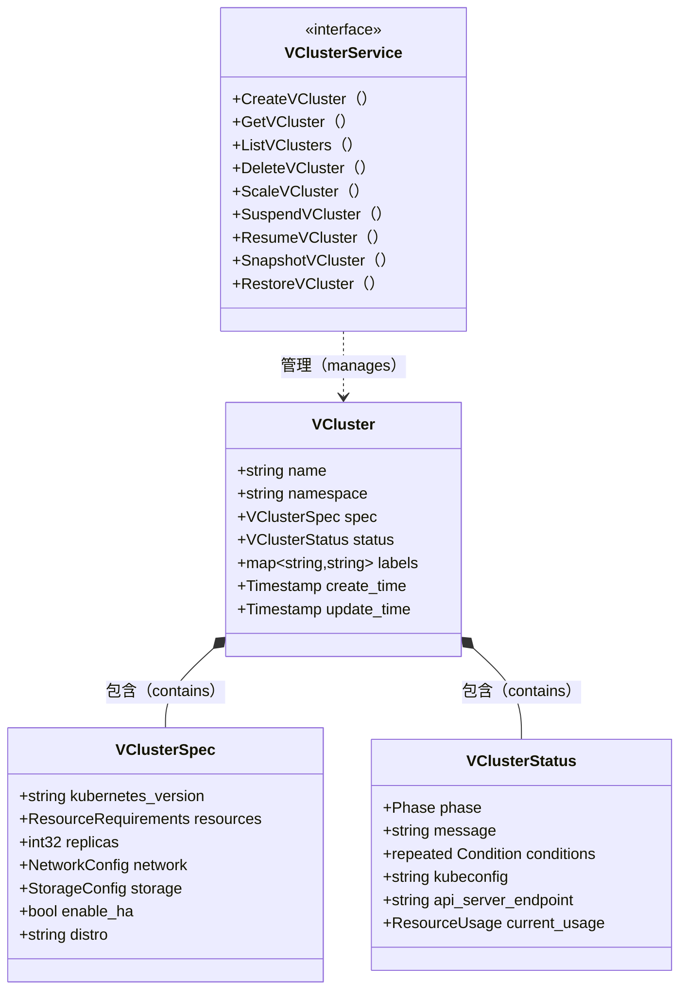
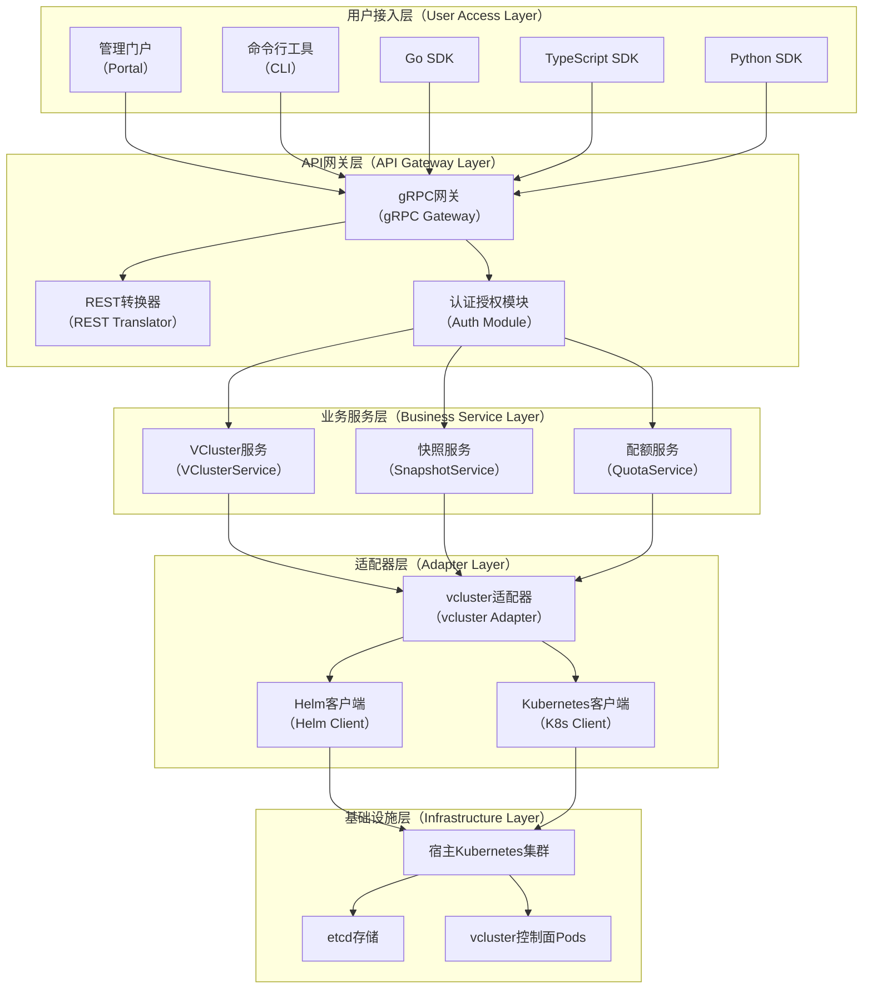

<div align="center">

# 🚀 open-vcluster-api

**A VM-like API for Managing Virtual Kubernetes Clusters**

[](LICENSE)
[](https://golang.org/)
[](https://protobuf.dev/)
[](https://www.vcluster.com/)

[English](#english) | [中文](#中文) | [QuickStart](QuickStart.md)

</div>

---

<a name="english"></a>

## 🌍 English

### What is open-vcluster-api?

**open-vcluster-api** is an open-source project that provides a **VM-like API** for managing [vcluster](https://www.vcluster.com/) (virtual Kubernetes clusters). It bridges the gap between traditional IaaS/VM management paradigms and cloud-native virtual cluster orchestration.

Users familiar with Virtual Machine lifecycle management can adopt vcluster with minimal learning curve, while still leveraging vcluster's unique capabilities.

### Design Goals

1. **Familiar Semantics**: Provide API operations that mirror VM lifecycle management (Create, Start, Stop, Snapshot, Restore)
2. **VCluster-Native**: All resources and operations are named around `VCluster`, not `VM` or `Instance`
3. **Extended Capabilities**: Expose vcluster-specific operations like `SuspendVCluster`, `ResumeVCluster`, `SnapshotVCluster`, and `RestoreVCluster`
4. **Cloud-Native Architecture**: gRPC-first API design with Protobuf IDL, suitable for Kubernetes-native environments
5. **Multi-Language Support**: Auto-generated SDKs for Go, TypeScript, and Python

### VM-like but VCluster-Native

While the API feels familiar to VM users, it respects vcluster's true nature:

| VM Concept | VCluster Equivalent | Key Difference |
|------------|---------------------|----------------|
| Power Off | `SuspendVCluster` | Scales down control-plane pods, optionally drains workloads |
| Power On | `ResumeVCluster` | Restores control-plane pods and reconciles workloads |
| Snapshot | `SnapshotVCluster` | Captures etcd state + metadata, not disk image |
| Resize | `ScaleVCluster` | Adjusts resource quotas and control-plane resources |

### Architecture

```mermaid
graph TB
    %% 图例说明
    subgraph Legend[图例（Legend）]
        L1[用户接口（User Interface）]
        L2[API层（API Layer）]
        L3[控制层（Control Layer）]
        L4[基础设施（Infrastructure）]
    end

    subgraph UI[用户接口（User Interface）]
        Portal[管理门户（Portal）]
        CLI[命令行工具（CLI）]
        SDK[多语言SDK（SDKs）]
    end

    subgraph API[API网关层（API Gateway Layer）]
        GW[API网关（Gateway）]
        Auth[认证授权（Auth）]
    end

    subgraph SVC[核心服务层（Core Service Layer）]
        VCS[VClusterService<br/>虚拟集群服务]
        SNS[SnapshotService<br/>快照服务]
        MON[MonitorService<br/>监控服务]
    end

    subgraph CTL[控制器层（Controller Layer）]
        Adapter[VCluster适配器（Adapter）]
        Reconciler[状态协调器（Reconciler）]
    end

    subgraph INFRA[基础设施层（Infrastructure）]
        HostK8s[宿主Kubernetes集群（Host K8s）]
        VClusterPods[vcluster控制面Pods]
        Storage[持久化存储（Storage）]
    end

    Portal --> GW
    CLI --> GW
    SDK --> GW
    GW --> Auth
    Auth --> VCS
    Auth --> SNS
    Auth --> MON
    VCS --> Adapter
    SNS --> Adapter
    Adapter --> Reconciler
    Reconciler --> HostK8s
    HostK8s --> VClusterPods
    VClusterPods --> Storage
````

### Quick Start

Please refer to [QuickStart.md](QuickStart.md) for detailed instructions on how to build, test, and run the project.

#### Prerequisites

* Go 1.21+
* Protocol Buffers compiler (`protoc`)
* Buf CLI (optional, for easier builds)

#### Generate Go Client/Server

```bash
# Clone the repository
git clone https://github.com/turtacn/open-vcluster-api.git
cd open-vcluster-api

# Generate code
make generate
```

#### Run Examples

```bash
# Build examples
make build

# Run all
make examples
```

### Core API Operations

| Operation          | Description                                     |
| ------------------ | ----------------------------------------------- |
| `CreateVCluster`   | Create a new virtual Kubernetes cluster         |
| `GetVCluster`      | Retrieve details of a specific vcluster         |
| `ListVClusters`    | List all vclusters with pagination              |
| `DeleteVCluster`   | Delete a vcluster                               |
| `ScaleVCluster`    | Adjust resources allocated to a vcluster        |
| `SuspendVCluster`  | Suspend a running vcluster (stop control-plane) |
| `ResumeVCluster`   | Resume a suspended vcluster                     |
| `SnapshotVCluster` | Create a point-in-time snapshot                 |
| `RestoreVCluster`  | Restore from a snapshot                         |

### Examples Directory

| Example                        | Description                                               |
| ------------------------------ | --------------------------------------------------------- |
| `simple-client-go/`            | Basic Go gRPC client demonstrating API calls              |
| `simple-server-go/`            | Minimal in-memory server implementation                   |
| `vcluster-adapter-controller/` | Production-ready controller integrated with loft/vcluster |

### Contributing

We welcome contributions! Please see [CONTRIBUTING.md](CONTRIBUTING.md) for guidelines.

### License

This project is licensed under the MIT License - see [LICENSE](LICENSE) for details.

---

<a name="中文"></a>

## 🇨🇳 中文

### 项目简介

**open-vcluster-api** 是一个开源项目，为 [vcluster](https://www.vcluster.com/)（虚拟Kubernetes集群）提供**类虚拟机风格的API**。该项目弥合了传统IaaS/虚拟机管理范式与云原生虚拟集群编排之间的鸿沟。

熟悉虚拟机生命周期管理的用户可以以最小的学习成本采用 vcluster，同时充分利用 vcluster 的独特能力。

### 为什么要给 vcluster 设计 VM 风格 API？

企业在进行云原生转型时，运维团队往往对虚拟机管理非常熟悉。通过提供类似VM的API语义，我们可以：

1. **降低认知门槛**：运维人员可以用熟悉的概念理解 vcluster
2. **平滑迁移路径**：从传统虚拟化平台迁移到 Kubernetes 多租户方案
3. **统一管理体验**：在混合环境中提供一致的资源管理界面
4. **保留云原生优势**：底层仍然是 Kubernetes 原生实现

### 设计原则

1. **语义熟悉性**：提供与VM生命周期管理类似的API操作（创建、启动、停止、快照、恢复）
2. **VCluster原生**：所有资源和操作都围绕 `VCluster` 命名，不使用 `VM` 或 `Instance`
3. **扩展能力**：暴露vcluster特有的操作，如 `SuspendVCluster`、`ResumeVCluster`、`SnapshotVCluster` 和 `RestoreVCluster`
4. **云原生架构**：gRPC优先的API设计，使用Protobuf IDL，适合Kubernetes原生环境
5. **多语言支持**：自动生成Go、TypeScript和Python的SDK

### API核心概念



### 架构图



### 快速开始

#### 前置条件

* Go 1.21+
* Protocol Buffers 编译器（`protoc`）
* Buf CLI（可选，用于简化构建）

#### 生成Go客户端/服务端代码

```bash
# 克隆仓库
git clone https://github.com/turtacn/open-vcluster-api.git
cd open-vcluster-api

# 使用buf生成代码
cd tools && buf generate

# 或直接使用protoc
protoc --go_out=. --go-grpc_out=. api/proto/vcluster_api.proto
```

#### 生成多语言SDK

```bash
# 生成所有语言的SDK（Go、TypeScript、Python）
./scripts/generate-sdk.sh all

# 生成特定语言的SDK
./scripts/generate-sdk.sh go
./scripts/generate-sdk.sh typescript
./scripts/generate-sdk.sh python
```

#### 运行示例服务端

```bash
cd examples/simple-server-go
go run main.go
```

#### 运行示例客户端

```bash
cd examples/simple-client-go
go run main.go
```

### 示例说明

| 示例                             | 描述                      |
| ------------------------------ | ----------------------- |
| `simple-client-go/`            | 基础Go gRPC客户端，演示API调用    |
| `simple-server-go/`            | 最小化的内存存储服务端实现           |
| `vcluster-adapter-controller/` | 与loft/vcluster集成的生产级控制器 |

### 如何贡献

我们欢迎各种形式的贡献！请参阅 [CONTRIBUTING.md](CONTRIBUTING.md) 了解贡献指南。

### 开源协议

本项目采用 MIT 协议开源 - 详见 [LICENSE](LICENSE) 文件。

---

## 参考资料

1. [vcluster Official Documentation](https://www.vcluster.com/docs/) - vcluster官方文档
2. [Loft Labs GitHub](https://github.com/loft-sh/vcluster) - vcluster开源实现
3. [gRPC Documentation](https://grpc.io/docs/) - gRPC官方文档
4. [Protocol Buffers Language Guide](https://protobuf.dev/programming-guides/proto3/) - Protobuf v3语法指南
5. [Kubernetes API Conventions](https://github.com/kubernetes/community/blob/master/contributors/devel/sig-architecture/api-conventions.md) - Kubernetes API设计规范
6. [Buf Documentation](https://buf.build/docs/) - Buf工具链文档