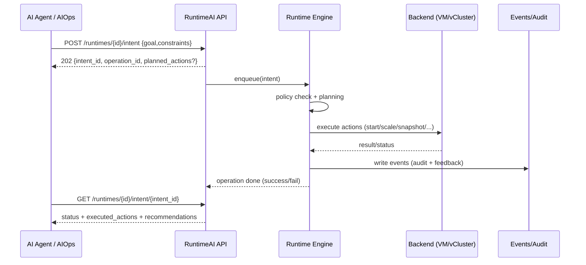

## 🧠 Project: **Runtime AI Control Plane**

### AI-Native Runtime Control Plane for VM, vCluster and Agent-Driven Operations

---

### 🚩 Problem

Modern infrastructure teams are facing a growing gap:

* **Virtual Machines (VMs)** offer a simple and mature lifecycle model, but lack cloud-native flexibility and AI readiness.
* **Kubernetes and vCluster** provide powerful multi-tenancy and orchestration, but introduce steep learning curves and operational complexity.
* **AI / AIOps / Agents** are emerging as operators, yet existing APIs are not designed for intent-driven or autonomous control.

As a result:

* Humans struggle with Kubernetes complexity.
* AI agents are reduced to command translators.
* VM-centric users cannot easily adopt cloud-native virtual clusters.

---

### 💡 Why Runtime AI Control Plane

This project bridges **three worlds**:

1. **VM lifecycle semantics** familiar to traditional IaaS users
2. **Cloud-native virtual clusters (vCluster)** for scalable multi-tenancy
3. **Intent-driven, agent-friendly APIs** for AI and AIOps systems

> Instead of forcing users and AI to learn Kubernetes internals,
> we let Kubernetes runtimes speak **VM and AI languages**.

---

### 🎯 What It Is

**Runtime AI Control Plane** is an **AI-native control layer** that:

* Unifies **VMs and vClusters** under a single **Runtime abstraction**
* Exposes **VM-style lifecycle APIs** (start / stop / scale / snapshot)
* Introduces **Intent-based APIs** designed for AI agents and AIOps
* Acts as a **semantic execution layer** for tools like `kubectl-ai`

---

### 🧱 Core Abstraction

```text
Runtime = A manageable execution environment with lifecycle, intent and feedback
```

A Runtime can be:

* a Virtual Machine
* a Virtual Kubernetes Cluster (vCluster)
* an AI / Agent execution sandbox

---

### 🧩 Architecture Overview

```text
+----------------------+
|  Human / AI Clients  |
|  CLI · UI · Agents   |
+----------+-----------+
           |
           v
+----------------------+
|  Runtime API Layer   |
|  - Lifecycle API     |
|  - Intent API        |
|  - Agent Actions     |
+----------+-----------+
           |
           v
+----------------------+
|  Runtime Engine      |
|  - Policy            |
|  - Planning          |
|  - Validation        |
+----------+-----------+
           |
           v
+----------------------+
|  Backends            |
|  VM · vCluster · K8s |
+----------------------+
```

---

### 🔌 API Layers

#### 1. Runtime Object API

```http
POST /runtimes
GET  /runtimes/{id}
```

#### 2. Lifecycle API (VM-style)

```http
POST /runtimes/{id}/start
POST /runtimes/{id}/scale
POST /runtimes/{id}/snapshot
```

#### 3. Intent API (AI-native)

```http
POST /runtimes/{id}/intent
```

```json
{
  "goal": "reduce cost",
  "constraints": {
    "latency": "<50ms",
    "availability": "high"
  }
}
```

#### 4. Agent Action API

```json
{
  "actions": [
    { "type": "scale", "params": { "size": "medium" } }
  ]
}
```

---

### 🤖 Designed for AI & AIOps

* Explicit intent semantics
* Deterministic action contracts
* Feedback-ready execution results
* Safe-by-default policies

This makes the platform a **true execution substrate** for:

* AIOps engines
* Autonomous agents
* Natural-language ops interfaces

---

### 🗺 Roadmap

* [ ] Runtime abstraction & core API
* [ ] VM backend adapter
* [ ] vCluster backend adapter
* [ ] Agent SDK
* [ ] Policy & safety engine
* [ ] CNCF sandbox proposal

---

### 📜 License

Apache 2.0

---

# 二、产业对标分析矩阵（1 页级）

> 可直接放在 README / 白皮书 / 投融资 PPT

| 项目                           | VM 心智模型 | vCluster | AI / Agent API | Intent 驱动 | 统一控制面 |
| ---------------------------- | ------- | -------- | -------------- | --------- | ----- |
| KubeVirt                     | ✅       | ❌        | ❌              | ❌         | ❌     |
| Harvester                    | ✅       | ❌        | ❌              | ❌         | ❌     |
| vcluster                     | ❌       | ✅        | ❌              | ❌         | ❌     |
| Crossplane                   | ❌       | ⚠️       | ❌              | ❌         | ⚠️    |
| kubectl-ai                   | ❌       | ❌        | ⚠️             | ❌         | ❌     |
| **Runtime AI Control Plane** | ✅       | ✅        | ✅              | ✅         | ✅     |

**一句总结**：

> *This project completes the missing layer between infrastructure control planes and AI-driven operations.*

---

# 三、CNCF / LF 级定位与命名建议

## 🎯 CNCF Landscape 定位

**Category**

> **Infrastructure → Orchestration & Management → Control Plane**

**Taglines**

* AI-Native Control Plane
* Intent-Driven Infrastructure
* Runtime Abstraction Layer

---

## 🏷 推荐项目命名（按 CNCF 风格）

### 首选（强烈推荐）

### **RuntimeAI**

* 简短
* 技术中性
* 不绑定 VM / K8s
* 对 AI 友好

### 备选

* **AgentRuntime**
* **IntentPlane**
* **RuntimeCTL**

---

## 🧭 CNCF Sandbox 叙事关键词

**符合 CNCF Sandbox 特征**：

* 非侵入式（Non-invasive）
* API / Control Plane 为主
* 明确生态价值
* 不与现有项目正面竞争

---

## 一句话 CNCF 级定义

> **RuntimeAI is an AI-native control plane that unifies VM and virtual Kubernetes cluster lifecycles under an intent-driven runtime abstraction, enabling autonomous agents and AIOps systems to safely operate cloud-native infrastructure.**

---

# 一句非常重要的话

> **不是“做一个工具”，
> 而是在为“AI 成为运维主体”准备基础设施语言。**

---

# 附件

一份**统一后的 RuntimeAI OpenAPI 3.1 规格（MVP 但结构完整）**，以及两种 **Mermaid 图**（架构/调用流）来展示 API 分层与典型流程。

---

## OpenAPI Spec (YAML)

```yaml
openapi: 3.1.0
info:
  title: RuntimeAI Control Plane API
  version: 0.1.0
  description: >
    AI-native runtime control plane that unifies VM and vCluster lifecycle under a single Runtime abstraction.
servers:
  - url: https://api.runtimeai.example.com/v1

tags:
  - name: Runtimes
  - name: Lifecycle
  - name: Intent
  - name: Actions
  - name: Events
  - name: Policies
  - name: Health

paths:
  /health:
    get:
      tags: [Health]
      summary: Health check
      operationId: getHealth
      responses:
        "200":
          description: OK
          content:
            application/json:
              schema:
                type: object
                properties:
                  status: { type: string, example: ok }
                  version: { type: string, example: 0.1.0 }

  /runtimes:
    post:
      tags: [Runtimes]
      summary: Create a runtime
      operationId: createRuntime
      requestBody:
        required: true
        content:
          application/json:
            schema:
              $ref: "#/components/schemas/RuntimeCreateRequest"
      responses:
        "201":
          description: Created
          content:
            application/json:
              schema:
                $ref: "#/components/schemas/Runtime"
    get:
      tags: [Runtimes]
      summary: List runtimes
      operationId: listRuntimes
      parameters:
        - $ref: "#/components/parameters/TenantId"
        - name: type
          in: query
          schema:
            $ref: "#/components/schemas/RuntimeType"
        - name: state
          in: query
          schema:
            $ref: "#/components/schemas/RuntimeState"
        - name: page_size
          in: query
          schema: { type: integer, minimum: 1, maximum: 200, default: 50 }
        - name: page_token
          in: query
          schema: { type: string }
      responses:
        "200":
          description: OK
          content:
            application/json:
              schema:
                $ref: "#/components/schemas/RuntimeListResponse"

  /runtimes/{runtime_id}:
    get:
      tags: [Runtimes]
      summary: Get a runtime
      operationId: getRuntime
      parameters:
        - $ref: "#/components/parameters/RuntimeId"
      responses:
        "200":
          description: OK
          content:
            application/json:
              schema:
                $ref: "#/components/schemas/Runtime"
    delete:
      tags: [Runtimes]
      summary: Delete a runtime
      operationId: deleteRuntime
      parameters:
        - $ref: "#/components/parameters/RuntimeId"
      responses:
        "202":
          description: Accepted (async delete)
          content:
            application/json:
              schema:
                $ref: "#/components/schemas/Operation"

  /runtimes/{runtime_id}/status:
    get:
      tags: [Runtimes]
      summary: Get runtime status & signals
      operationId: getRuntimeStatus
      parameters:
        - $ref: "#/components/parameters/RuntimeId"
      responses:
        "200":
          description: OK
          content:
            application/json:
              schema:
                $ref: "#/components/schemas/RuntimeStatus"

  # ----------------------
  # Lifecycle (VM-style)
  # ----------------------
  /runtimes/{runtime_id}/lifecycle/start:
    post:
      tags: [Lifecycle]
      summary: Start runtime
      operationId: startRuntime
      parameters:
        - $ref: "#/components/parameters/RuntimeId"
      requestBody:
        required: false
        content:
          application/json:
            schema:
              $ref: "#/components/schemas/LifecycleStartRequest"
      responses:
        "202":
          description: Accepted
          content:
            application/json:
              schema:
                $ref: "#/components/schemas/Operation"

  /runtimes/{runtime_id}/lifecycle/stop:
    post:
      tags: [Lifecycle]
      summary: Stop runtime
      operationId: stopRuntime
      parameters:
        - $ref: "#/components/parameters/RuntimeId"
      requestBody:
        required: false
        content:
          application/json:
            schema:
              $ref: "#/components/schemas/LifecycleStopRequest"
      responses:
        "202":
          description: Accepted
          content:
            application/json:
              schema:
                $ref: "#/components/schemas/Operation"

  /runtimes/{runtime_id}/lifecycle/restart:
    post:
      tags: [Lifecycle]
      summary: Restart runtime
      operationId: restartRuntime
      parameters:
        - $ref: "#/components/parameters/RuntimeId"
      responses:
        "202":
          description: Accepted
          content:
            application/json:
              schema:
                $ref: "#/components/schemas/Operation"

  /runtimes/{runtime_id}/lifecycle/scale:
    post:
      tags: [Lifecycle]
      summary: Scale runtime (size / replicas / resources)
      operationId: scaleRuntime
      parameters:
        - $ref: "#/components/parameters/RuntimeId"
      requestBody:
        required: true
        content:
          application/json:
            schema:
              $ref: "#/components/schemas/LifecycleScaleRequest"
      responses:
        "202":
          description: Accepted
          content:
            application/json:
              schema:
                $ref: "#/components/schemas/Operation"

  /runtimes/{runtime_id}/lifecycle/snapshot:
    post:
      tags: [Lifecycle]
      summary: Snapshot runtime (VM snapshot / vCluster backup)
      operationId: snapshotRuntime
      parameters:
        - $ref: "#/components/parameters/RuntimeId"
      requestBody:
        required: false
        content:
          application/json:
            schema:
              $ref: "#/components/schemas/LifecycleSnapshotRequest"
      responses:
        "202":
          description: Accepted
          content:
            application/json:
              schema:
                $ref: "#/components/schemas/Operation"

  # ----------------------
  # Intent (AI-native)
  # ----------------------
  /runtimes/{runtime_id}/intent:
    post:
      tags: [Intent]
      summary: Submit an intent for a runtime (AI/AIOps/Agent-native)
      operationId: submitIntent
      parameters:
        - $ref: "#/components/parameters/RuntimeId"
      requestBody:
        required: true
        content:
          application/json:
            schema:
              $ref: "#/components/schemas/IntentRequest"
      responses:
        "202":
          description: Accepted (planned + executed async)
          content:
            application/json:
              schema:
                $ref: "#/components/schemas/IntentResponse"

  /runtimes/{runtime_id}/intent/{intent_id}:
    get:
      tags: [Intent]
      summary: Get intent status/result
      operationId: getIntent
      parameters:
        - $ref: "#/components/parameters/RuntimeId"
        - name: intent_id
          in: path
          required: true
          schema: { type: string }
      responses:
        "200":
          description: OK
          content:
            application/json:
              schema:
                $ref: "#/components/schemas/IntentRecord"

  # ----------------------
  # Actions (deterministic contract for agents)
  # ----------------------
  /runtimes/{runtime_id}/actions/plan:
    post:
      tags: [Actions]
      summary: Ask system to produce an action plan from goal/signals (no execution)
      operationId: planActions
      parameters:
        - $ref: "#/components/parameters/RuntimeId"
      requestBody:
        required: true
        content:
          application/json:
            schema:
              $ref: "#/components/schemas/ActionPlanRequest"
      responses:
        "200":
          description: Action plan
          content:
            application/json:
              schema:
                $ref: "#/components/schemas/ActionPlan"

  /runtimes/{runtime_id}/actions/execute:
    post:
      tags: [Actions]
      summary: Execute a deterministic action list (agent tool-call contract)
      operationId: executeActions
      parameters:
        - $ref: "#/components/parameters/RuntimeId"
      requestBody:
        required: true
        content:
          application/json:
            schema:
              $ref: "#/components/schemas/ActionExecutionRequest"
      responses:
        "202":
          description: Accepted
          content:
            application/json:
              schema:
                $ref: "#/components/schemas/Operation"

  # ----------------------
  # Events (audit + feedback loop)
  # ----------------------
  /runtimes/{runtime_id}/events:
    get:
      tags: [Events]
      summary: List runtime events (audit + ops feedback)
      operationId: listEvents
      parameters:
        - $ref: "#/components/parameters/RuntimeId"
        - name: since
          in: query
          schema: { type: string, format: date-time }
        - name: limit
          in: query
          schema: { type: integer, minimum: 1, maximum: 500, default: 100 }
      responses:
        "200":
          description: OK
          content:
            application/json:
              schema:
                $ref: "#/components/schemas/EventListResponse"

  # ----------------------
  # Policies (safety & governance)
  # ----------------------
  /policies:
    post:
      tags: [Policies]
      summary: Create a policy (tenant / env scoped)
      operationId: createPolicy
      requestBody:
        required: true
        content:
          application/json:
            schema:
              $ref: "#/components/schemas/PolicyCreateRequest"
      responses:
        "201":
          description: Created
          content:
            application/json:
              schema:
                $ref: "#/components/schemas/Policy"
    get:
      tags: [Policies]
      summary: List policies
      operationId: listPolicies
      parameters:
        - $ref: "#/components/parameters/TenantId"
        - name: scope_env
          in: query
          schema: { type: string, example: production }
      responses:
        "200":
          description: OK
          content:
            application/json:
              schema:
                $ref: "#/components/schemas/PolicyListResponse"

  /policies/{policy_id}:
    get:
      tags: [Policies]
      summary: Get policy
      operationId: getPolicy
      parameters:
        - name: policy_id
          in: path
          required: true
          schema: { type: string }
      responses:
        "200":
          description: OK
          content:
            application/json:
              schema:
                $ref: "#/components/schemas/Policy"
    delete:
      tags: [Policies]
      summary: Delete policy
      operationId: deletePolicy
      parameters:
        - name: policy_id
          in: path
          required: true
          schema: { type: string }
      responses:
        "204":
          description: Deleted

  # ----------------------
  # Operations (async)
  # ----------------------
  /operations/{operation_id}:
    get:
      tags: [Runtimes]
      summary: Get async operation
      operationId: getOperation
      parameters:
        - name: operation_id
          in: path
          required: true
          schema: { type: string }
      responses:
        "200":
          description: OK
          content:
            application/json:
              schema:
                $ref: "#/components/schemas/Operation"

components:
  parameters:
    RuntimeId:
      name: runtime_id
      in: path
      required: true
      schema: { type: string }
    TenantId:
      name: tenant_id
      in: header
      required: false
      schema: { type: string }
      description: Optional tenant identifier for multi-tenancy.

  schemas:
    RuntimeType:
      type: string
      enum: [vm, vcluster, sandbox, agent_runtime]

    RuntimeState:
      type: string
      enum: [creating, running, stopped, degraded, deleting, deleted, error]

    Runtime:
      type: object
      required: [id, name, type, state, created_at]
      properties:
        id: { type: string, example: rt_01HXYZ... }
        name: { type: string, example: finance-prod }
        type: { $ref: "#/components/schemas/RuntimeType" }
        state: { $ref: "#/components/schemas/RuntimeState" }
        tenant_id: { type: string, nullable: true }
        labels:
          type: object
          additionalProperties: { type: string }
        capabilities:
          type: array
          items: { type: string, example: scale }
        backend:
          $ref: "#/components/schemas/RuntimeBackendRef"
        spec:
          $ref: "#/components/schemas/RuntimeSpec"
        created_at: { type: string, format: date-time }
        updated_at: { type: string, format: date-time, nullable: true }

    RuntimeBackendRef:
      type: object
      properties:
        kind:
          type: string
          enum: [vm_backend, vcluster_backend, k8s_backend, custom]
        ref:
          type: string
          description: Backend-specific identifier (opaque)

    RuntimeSpec:
      type: object
      properties:
        size:
          type: string
          description: T-shirt size or profile
          example: medium
        resources:
          $ref: "#/components/schemas/ResourceProfile"
        networking:
          $ref: "#/components/schemas/NetworkingProfile"
        security:
          $ref: "#/components/schemas/SecurityProfile"

    ResourceProfile:
      type: object
      properties:
        cpu: { type: number, nullable: true, example: 4 }
        memory: { type: string, nullable: true, example: 8Gi }
        gpu: { type: string, nullable: true, example: "1xA10" }
        replicas: { type: integer, nullable: true, example: 3 }

    NetworkingProfile:
      type: object
      properties:
        exposure:
          type: string
          enum: [private, internal, public]
          default: private
        egress_policy:
          type: string
          enum: [restricted, open]
          default: restricted

    SecurityProfile:
      type: object
      properties:
        isolation:
          type: string
          enum: [basic, strong]
          default: strong
        compliance:
          type: array
          items: { type: string, example: pci }
        audit:
          type: boolean
          default: true

    RuntimeCreateRequest:
      type: object
      required: [name, type]
      properties:
        name: { type: string }
        type: { $ref: "#/components/schemas/RuntimeType" }
        tenant_id: { type: string, nullable: true }
        labels:
          type: object
          additionalProperties: { type: string }
        spec:
          $ref: "#/components/schemas/RuntimeSpec"

    RuntimeListResponse:
      type: object
      required: [items]
      properties:
        items:
          type: array
          items: { $ref: "#/components/schemas/Runtime" }
        next_page_token: { type: string, nullable: true }

    RuntimeStatus:
      type: object
      required: [runtime_id, state, observed_at]
      properties:
        runtime_id: { type: string }
        state: { $ref: "#/components/schemas/RuntimeState" }
        health:
          type: string
          enum: [ok, warning, critical, unknown]
        signals:
          type: object
          additionalProperties:
            type: object
            properties:
              value: {}
              unit: { type: string, nullable: true }
              ts: { type: string, format: date-time }
        observed_at: { type: string, format: date-time }

    LifecycleStartRequest:
      type: object
      properties:
        reason: { type: string, nullable: true }

    LifecycleStopRequest:
      type: object
      properties:
        force: { type: boolean, default: false }
        timeout_seconds: { type: integer, nullable: true }

    LifecycleScaleRequest:
      type: object
      properties:
        size: { type: string, nullable: true, example: large }
        resources: { $ref: "#/components/schemas/ResourceProfile" }

    LifecycleSnapshotRequest:
      type: object
      properties:
        name: { type: string, nullable: true }
        description: { type: string, nullable: true }

    IntentRequest:
      type: object
      required: [goal]
      properties:
        goal:
          type: string
          example: reduce cost while keeping latency < 50ms
        constraints:
          type: object
          additionalProperties: {}
          example:
            latency: "<50ms"
            availability: "high"
            cost: "optimize"
        context:
          type: object
          additionalProperties: {}
          example:
            env: production
            service: risk-api
        policy_mode:
          type: string
          enum: [safe_first, balanced, aggressive]
          default: safe_first
        dry_run:
          type: boolean
          default: false

    IntentResponse:
      type: object
      required: [intent_id, operation_id, status]
      properties:
        intent_id: { type: string }
        operation_id: { type: string }
        status:
          type: string
          enum: [accepted, planned, executing, succeeded, failed]
        planned_actions:
          type: array
          items: { $ref: "#/components/schemas/Action" }

    IntentRecord:
      type: object
      required: [intent_id, runtime_id, request, status, created_at]
      properties:
        intent_id: { type: string }
        runtime_id: { type: string }
        request: { $ref: "#/components/schemas/IntentRequest" }
        status:
          type: string
          enum: [accepted, planned, executing, succeeded, failed, cancelled]
        result:
          $ref: "#/components/schemas/IntentResult"
        created_at: { type: string, format: date-time }
        finished_at: { type: string, format: date-time, nullable: true }

    IntentResult:
      type: object
      properties:
        summary: { type: string }
        executed_actions:
          type: array
          items: { $ref: "#/components/schemas/ActionResult" }
        recommendations:
          type: array
          items: { type: string }

    ActionPlanRequest:
      type: object
      required: [goal]
      properties:
        goal: { type: string }
        signals:
          type: object
          additionalProperties: {}
        constraints:
          type: object
          additionalProperties: {}
        policy_mode:
          type: string
          enum: [safe_first, balanced, aggressive]
          default: safe_first

    ActionPlan:
      type: object
      required: [actions]
      properties:
        actions:
          type: array
          items: { $ref: "#/components/schemas/Action" }
        rationale:
          type: array
          items: { type: string }

    ActionExecutionRequest:
      type: object
      required: [actions]
      properties:
        actions:
          type: array
          items: { $ref: "#/components/schemas/Action" }
        idempotency_key:
          type: string
          nullable: true

    Action:
      type: object
      required: [type]
      properties:
        type:
          type: string
          enum:
            - start
            - stop
            - restart
            - scale
            - snapshot
            - migrate
            - rollout_restart
            - tune_policy
            - attach_observer
            - detach_observer
        target:
          type: object
          nullable: true
          description: Optional sub-target (component / namespace / node)
          additionalProperties: {}
        params:
          type: object
          nullable: true
          additionalProperties: {}

    ActionResult:
      type: object
      required: [action, status]
      properties:
        action: { $ref: "#/components/schemas/Action" }
        status:
          type: string
          enum: [succeeded, failed, skipped]
        message: { type: string, nullable: true }

    Event:
      type: object
      required: [id, runtime_id, type, ts]
      properties:
        id: { type: string }
        runtime_id: { type: string }
        type: { type: string, example: lifecycle.scale }
        severity:
          type: string
          enum: [info, warning, critical]
          default: info
        ts: { type: string, format: date-time }
        actor:
          type: string
          description: human | agent | system
          example: agent
        data:
          type: object
          additionalProperties: {}

    EventListResponse:
      type: object
      required: [items]
      properties:
        items:
          type: array
          items: { $ref: "#/components/schemas/Event" }

    PolicyCreateRequest:
      type: object
      required: [name, rules]
      properties:
        name: { type: string }
        tenant_id: { type: string, nullable: true }
        scope_env: { type: string, nullable: true, example: production }
        rules:
          type: array
          items: { $ref: "#/components/schemas/PolicyRule" }

    Policy:
      type: object
      required: [id, name, rules, created_at]
      properties:
        id: { type: string }
        name: { type: string }
        tenant_id: { type: string, nullable: true }
        scope_env: { type: string, nullable: true }
        rules:
          type: array
          items: { $ref: "#/components/schemas/PolicyRule" }
        created_at: { type: string, format: date-time }

    PolicyRule:
      type: object
      required: [kind]
      properties:
        kind:
          type: string
          enum: [deny_action, allow_action, require_approval, budget_guardrail, data_egress]
        selector:
          type: object
          nullable: true
          additionalProperties: {}
        params:
          type: object
          nullable: true
          additionalProperties: {}

    PolicyListResponse:
      type: object
      required: [items]
      properties:
        items:
          type: array
          items: { $ref: "#/components/schemas/Policy" }

    Operation:
      type: object
      required: [id, status, created_at]
      properties:
        id: { type: string }
        status:
          type: string
          enum: [queued, running, succeeded, failed, cancelled]
        created_at: { type: string, format: date-time }
        finished_at: { type: string, format: date-time, nullable: true }
        progress:
          type: object
          nullable: true
          properties:
            percent: { type: integer, minimum: 0, maximum: 100 }
            message: { type: string, nullable: true }
        error:
          type: object
          nullable: true
          properties:
            code: { type: string }
            message: { type: string }
```

---

## 1：API 分层 + 后端适配（架构图）

```mermaid
flowchart TB
  subgraph Clients
    H[Human CLI/UI]
    A[AI Agent / AIOps]
  end

  subgraph ControlPlane[RuntimeAI Control Plane]
    API[Unified Runtime API\n- Runtimes\n- Lifecycle\n- Intent\n- Actions\n- Events\n- Policies]
    ENG[Runtime Engine\n- Policy\n- Planning\n- Validation\n- Execution]
  end

  subgraph Backends
    VM[VM Backend\n(OpenStack/VMware/KVM/...)]
    VC[vCluster Backend\n(Loft vcluster)]
    K8S[Kubernetes Backend\n(optional adapters)]
  end

  H --> API
  A --> API
  API --> ENG
  ENG --> VM
  ENG --> VC
  ENG --> K8S
```

---

## 2：典型“Intent → Plan → Execute → Feedback”时序图



---

未来可以补充下面的内容：

* **认证鉴权**（API Key/JWT、RBAC、tenant scope）
* **Webhooks / SSE**（事件推送给 Agent）
* **Adapter 插件协议**（VM/vCluster backend 的标准接口）
