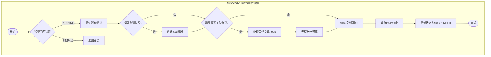
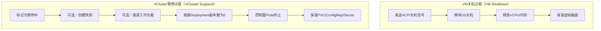
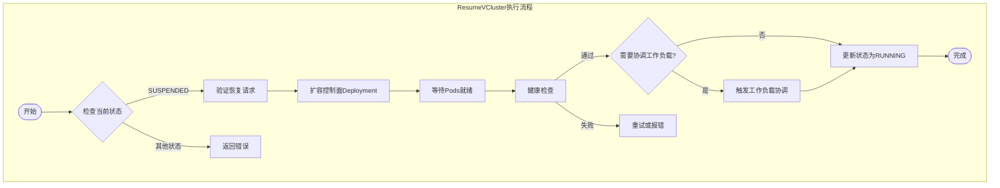
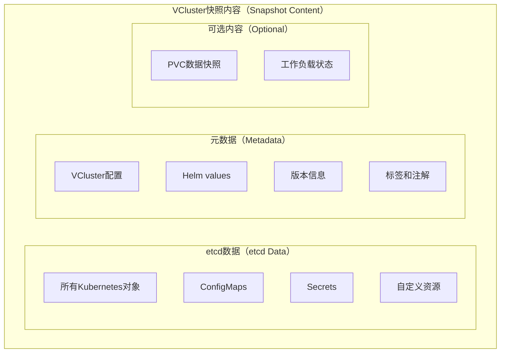
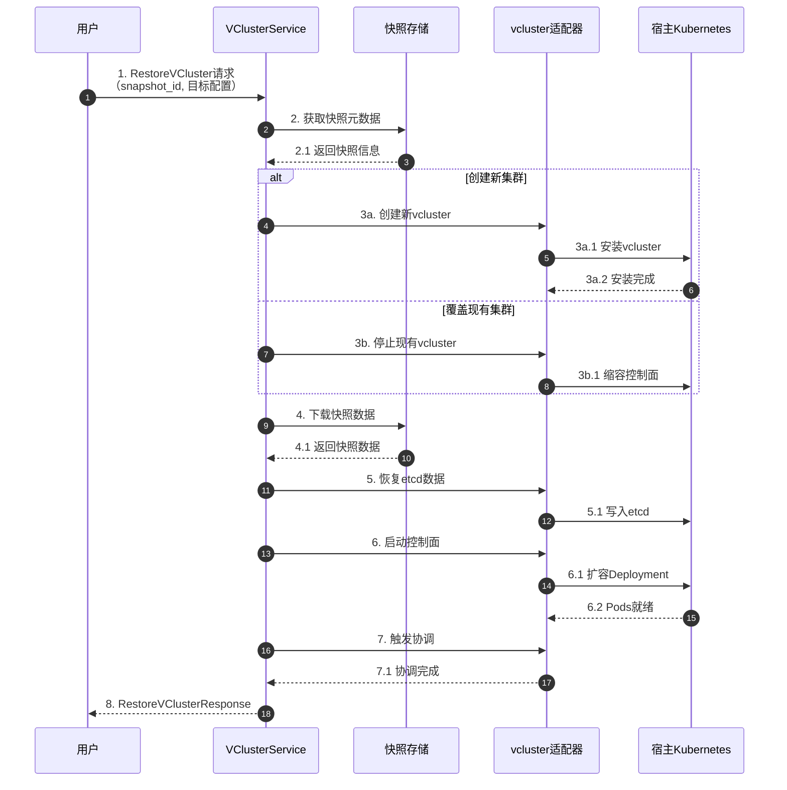
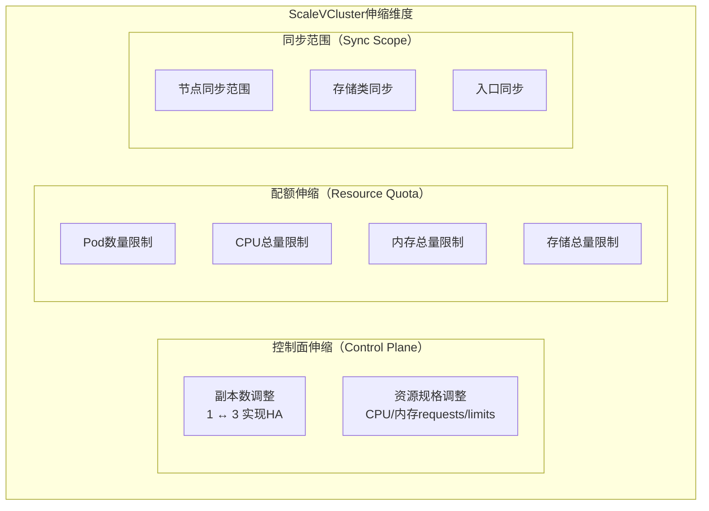
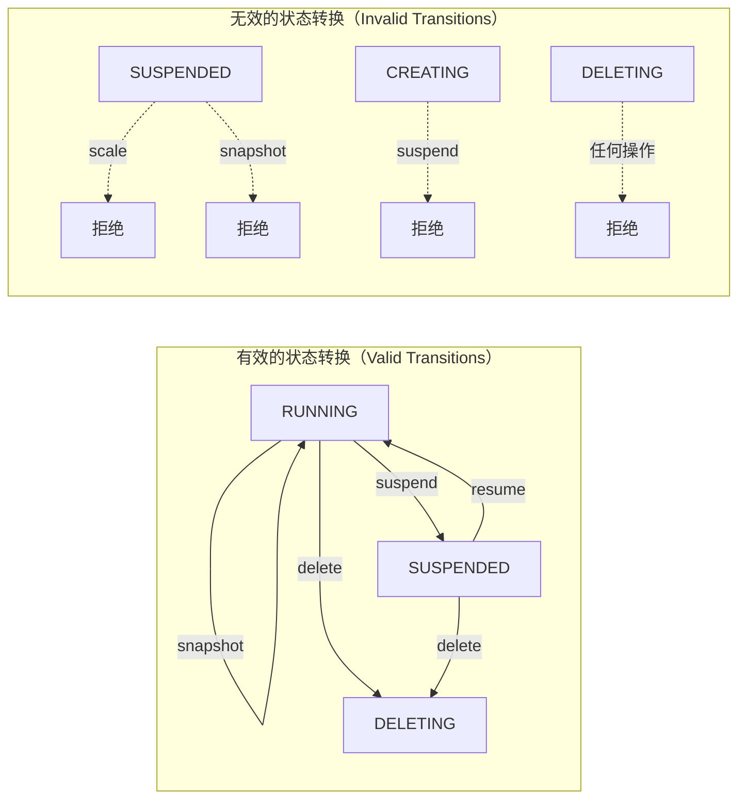

# API语义说明

本文档详细描述open-vcluster-api中各操作的语义，特别是与传统虚拟机操作的差异。理解这些差异对于正确使用API至关重要。

## 核心设计理念

open-vcluster-api采用VM风格的API设计，但底层实现完全基于vcluster的云原生特性。每个操作都经过精心设计，既保持了VM用户的使用习惯，又充分利用了Kubernetes的能力。

```mermaid
graph LR
    %% VM概念到vcluster实现的映射
    subgraph VM_CONCEPTS[VM概念（VM Concepts）]
        VM_CREATE[创建虚拟机]
        VM_STOP[关机]
        VM_START[开机]
        VM_SNAPSHOT[快照]
        VM_RESIZE[调整规格]
    end

    subgraph MAPPING[语义映射（Semantic Mapping）]
        M1[概念转换]
    end

    subgraph VC_IMPL[vcluster实现（VCluster Implementation）]
        VC_CREATE[Helm安装vcluster]
        VC_SUSPEND[缩容控制面Pods]
        VC_RESUME[扩容控制面Pods]
        VC_SNAPSHOT[etcd快照+元数据]
        VC_SCALE[调整ResourceQuota]
    end

    VM_CREATE --> M1 --> VC_CREATE
    VM_STOP --> M1 --> VC_SUSPEND
    VM_START --> M1 --> VC_RESUME
    VM_SNAPSHOT --> M1 --> VC_SNAPSHOT
    VM_RESIZE --> M1 --> VC_SCALE
````

## 操作语义对照表

| VM操作 | VCluster操作       | VM含义        | VCluster含义            | 关键差异        |
| ---- | ---------------- | ----------- | --------------------- | ----------- |
| 创建   | CreateVCluster   | 分配物理资源、安装OS | 在宿主集群创建命名空间、部署控制面Pods | 秒级创建 vs 分钟级 |
| 关机   | SuspendVCluster  | 断电、保存内存状态   | 缩容控制面到0副本、可选驱逐工作负载    | 无"电源"概念     |
| 开机   | ResumeVCluster   | 上电、恢复运行     | 扩容控制面、等待就绪            | 无BIOS启动过程   |
| 快照   | SnapshotVCluster | 磁盘镜像快照      | etcd数据备份+元数据导出        | 不包含"磁盘"镜像   |
| 恢复   | RestoreVCluster  | 从镜像恢复磁盘     | 恢复etcd数据、重新协调资源       | 恢复的是API对象   |
| 调整规格 | ScaleVCluster    | 修改vCPU/内存   | 调整ResourceQuota和Pod资源 | 资源模型不同      |
| 删除   | DeleteVCluster   | 释放物理资源      | 卸载Helm release、删除命名空间 | 无磁盘擦除       |

## 详细语义说明

### CreateVCluster - 创建虚拟集群

#### VM类比

在虚拟机环境中，创建VM通常包括：

* 分配物理计算资源（CPU、内存）
* 创建虚拟磁盘
* 安装操作系统
* 配置网络

#### VCluster实现

```mermaid
sequenceDiagram
    autonumber
    participant User as 用户
    participant API as VClusterService
    participant Helm as Helm客户端
    participant K8s as 宿主Kubernetes
    participant NS as 目标命名空间

    User->>API: 1. CreateVCluster请求<br/>（名称、规格、配置）
    
    API->>K8s: 2. 创建目标命名空间
    K8s->>NS: 2.1 命名空间就绪
    
    API->>Helm: 3. 安装vcluster Chart
    Note over Helm: 3.1 渲染Helm模板<br/>3.2 生成K8s资源清单
    
    Helm->>K8s: 4. 创建资源
    Note over K8s: 4.1 StatefulSet（控制面）<br/>4.2 Service（API Server）<br/>4.3 Secret（kubeconfig）<br/>4.4 RBAC资源
    
    K8s-->>Helm: 5. 资源创建成功
    Helm-->>API: 5.1 安装完成
    
    API->>K8s: 6. 等待控制面就绪
    K8s-->>API: 6.1 Pods Running
    
    API-->>User: 7. 返回VCluster对象<br/>（含kubeconfig）
```

#### 关键差异

| 方面   | 虚拟机       | VCluster    |
| ---- | --------- | ----------- |
| 创建时间 | 分钟级（安装OS） | 秒级（Pod调度）   |
| 资源分配 | 独占物理资源    | 共享宿主资源      |
| 隔离级别 | 硬件级隔离     | 命名空间+API级隔离 |
| 网络   | 虚拟网卡      | CNI插件       |

### SuspendVCluster - 暂停虚拟集群

#### VM类比

虚拟机"关机"操作通常意味着：

* 向操作系统发送关机信号
* 等待进程正常终止
* 保存内存状态（休眠）或直接断电
* 释放计算资源

#### VCluster实现



#### 语义差异详解

**VM关机 vs VCluster暂停：**



| 方面   | VM关机        | VCluster暂停      |
| ---- | ----------- | --------------- |
| 触发方式 | ACPI信号      | 修改Deployment副本数 |
| 状态保存 | 内存快照（可选）    | etcd持久化数据       |
| 工作负载 | 随VM停止       | 可选择保留或驱逐        |
| 资源释放 | CPU/内存立即释放  | Pod资源释放，PVC保留   |
| 恢复时间 | 秒级（从休眠）或分钟级 | 秒级（Pod重新调度）     |

### ResumeVCluster - 恢复虚拟集群

#### VM类比

虚拟机"开机"操作包括：

* 分配计算资源
* 恢复内存状态（从休眠）或执行BIOS/OS启动
* 等待操作系统就绪
* 恢复网络连接

#### VCluster实现



### SnapshotVCluster - 快照虚拟集群

#### VM类比

虚拟机快照通常捕获：

* 虚拟磁盘的完整状态
* 内存状态（可选）
* 设备配置
* 网络配置

#### VCluster实现



#### 快照对比

| 方面   | VM快照     | VCluster快照 |
| ---- | -------- | ---------- |
| 数据类型 | 磁盘块级数据   | API对象级数据   |
| 大小   | GB级（含OS） | MB级（仅元数据）  |
| 创建速度 | 分钟级      | 秒级         |
| 一致性  | 需要静默文件系统 | etcd事务一致性  |
| 存储位置 | 存储系统快照   | 对象存储       |
| 恢复粒度 | 全量恢复     | 可选择性恢复     |

### RestoreVCluster - 恢复虚拟集群

#### 恢复流程



### ScaleVCluster - 伸缩虚拟集群

#### VM类比

虚拟机规格调整：

* 修改vCPU数量
* 调整内存大小
* 通常需要重启

#### VCluster实现



#### 语义差异

| 方面   | VM伸缩       | VCluster伸缩          |
| ---- | ---------- | ------------------- |
| 资源类型 | vCPU、内存、磁盘 | ResourceQuota、Pod资源 |
| 停机需求 | 通常需要       | 通常不需要               |
| 生效时间 | 重启后生效      | 即时/滚动生效             |
| 粒度   | 固定规格       | 精细控制                |
| 弹性   | 垂直伸缩为主     | 水平+垂直               |

## 错误处理语义

### 错误码定义

| 错误码                 | 含义      | 对应HTTP状态 | 处理建议      |
| ------------------- | ------- | -------- | --------- |
| NOT_FOUND           | 资源不存在   | 404      | 检查名称和命名空间 |
| ALREADY_EXISTS      | 资源已存在   | 409      | 使用不同名称或更新 |
| INVALID_ARGUMENT    | 参数无效    | 400      | 检查请求参数    |
| FAILED_PRECONDITION | 前置条件不满足 | 400      | 检查资源状态    |
| RESOURCE_EXHAUSTED  | 资源配额不足  | 429      | 释放资源或扩容   |
| INTERNAL            | 内部错误    | 500      | 联系管理员     |
| UNAVAILABLE         | 服务不可用   | 503      | 稍后重试      |

### 状态转换约束



## 幂等性保证

所有写操作都支持幂等性，通过`request_id`字段实现：

```protobuf
message CreateVClusterRequest {
  // ... 其他字段
  string request_id = 5;  // 客户端生成的唯一请求ID
}
```

* 相同`request_id`的重复请求会返回相同结果
* 服务端保留请求ID记录至少24小时
* 建议使用UUID v4生成`request_id`

## 参考资料

1. [vcluster Suspend/Resume](https://www.vcluster.com/docs/using-vclusters/pausing-resuming) - vcluster暂停恢复官方文档
2. [Kubernetes Resource Management](https://kubernetes.io/docs/concepts/configuration/manage-resources-containers/) - Kubernetes资源管理
3. [etcd Backup and Restore](https://etcd.io/docs/v3.5/op-guide/recovery/) - etcd备份恢复
4. [Google API Design Guide - Errors](https://cloud.google.com/apis/design/errors) - API错误设计指南
5. [Idempotency in APIs](https://stripe.com/docs/api/idempotent_requests) - API幂等性设计参考
