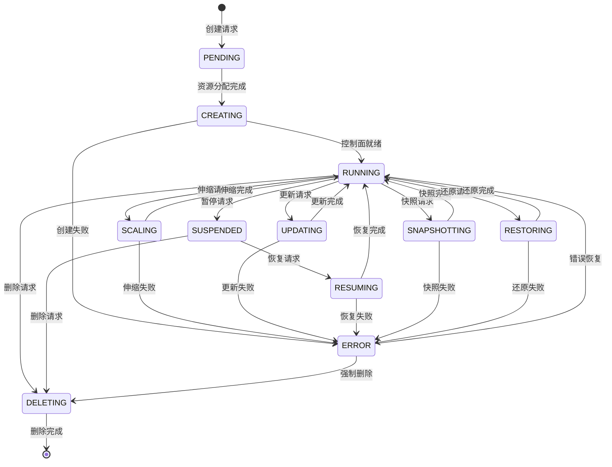
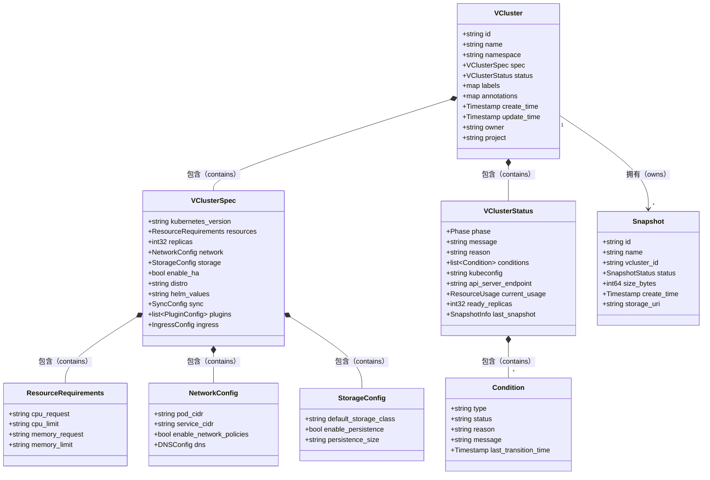
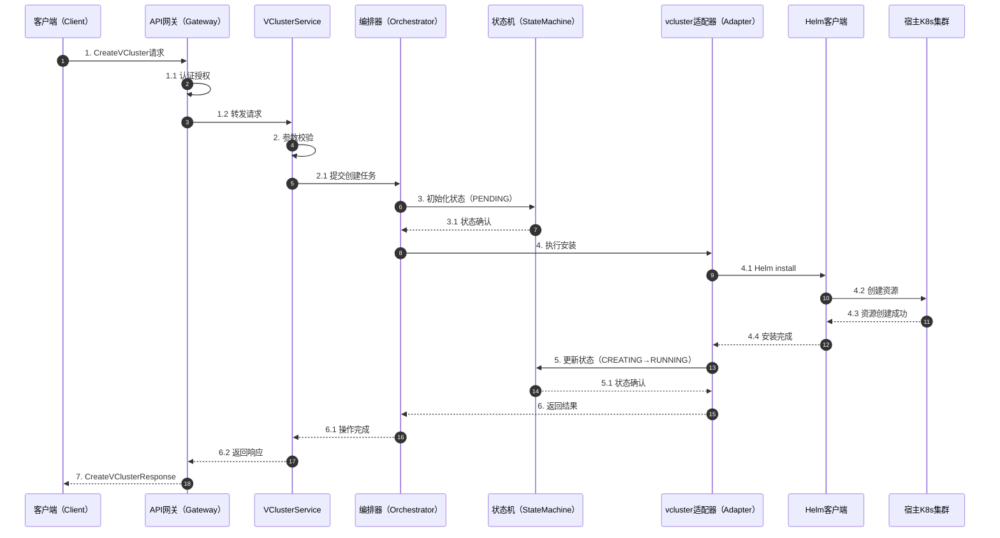
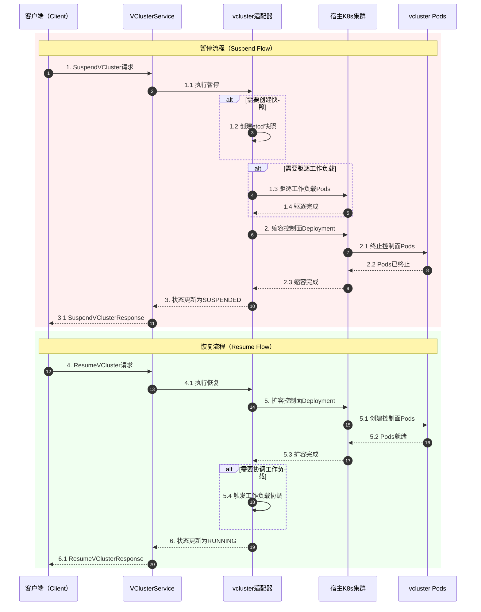
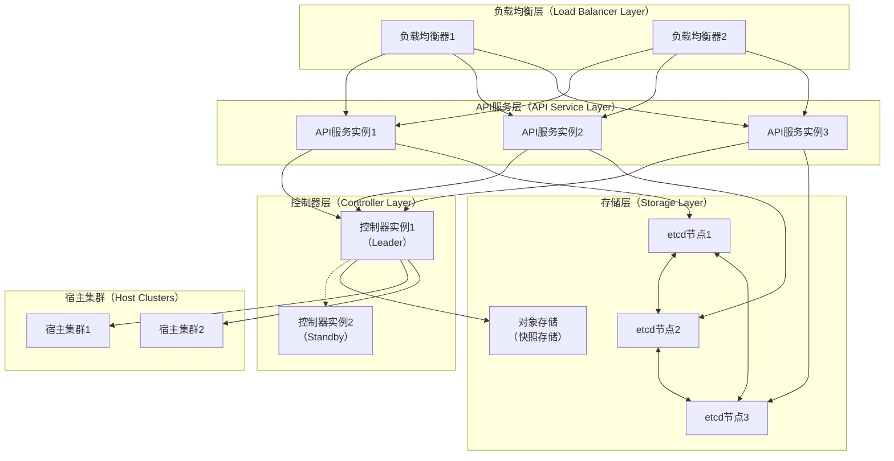

# 系统架构设计

本文档详细描述open-vcluster-api的系统架构设计，包括整体架构、核心组件、资源模型和生命周期管理。

## 整体架构

open-vcluster-api采用分层架构设计，实现了关注点分离和模块化组织。

### 架构分层图

```mermaid
graph TB
    %% 图例
    subgraph Legend[图例（Legend）]
        direction LR
        L1[用户层]
        L2[接入层]
        L3[服务层]
        L4[适配层]
        L5[基础设施层]
    end

    %% 用户接入层
    subgraph USER[用户接入层（User Access Layer）]
        Portal[管理门户<br/>（Web Portal）]
        CLI[命令行工具<br/>（CLI Tool）]
        SDK_GO[Go SDK]
        SDK_TS[TypeScript SDK]
        SDK_PY[Python SDK]
        THIRD[第三方集成<br/>（Third-party Integration）]
    end

    %% API网关层
    subgraph GATEWAY[API网关层（API Gateway Layer）]
        GRPC_GW[gRPC网关<br/>（gRPC Gateway）]
        REST_GW[REST网关<br/>（REST Gateway）]
        LB[负载均衡<br/>（Load Balancer）]
        AUTH[认证服务<br/>（Authentication）]
        AUTHZ[授权服务<br/>（Authorization）]
        RATE[限流服务<br/>（Rate Limiter）]
    end

    %% 业务服务层
    subgraph SERVICE[业务服务层（Business Service Layer）]
        VCS[VClusterService<br/>虚拟集群服务]
        SNAP_SVC[SnapshotService<br/>快照服务]
        QUOTA_SVC[QuotaService<br/>配额服务]
        AUDIT_SVC[AuditService<br/>审计服务]
        NOTIFY_SVC[NotifyService<br/>通知服务]
    end

    %% 核心引擎层
    subgraph ENGINE[核心引擎层（Core Engine Layer）]
        ORCH[编排引擎<br/>（Orchestrator）]
        STATE[状态机<br/>（State Machine）]
        SCHEDULER[调度器<br/>（Scheduler）]
        VALIDATOR[校验器<br/>（Validator）]
    end

    %% 适配器层
    subgraph ADAPTER[适配器层（Adapter Layer）]
        VC_ADAPTER[vcluster适配器<br/>（vcluster Adapter）]
        HELM_CLIENT[Helm客户端<br/>（Helm Client）]
        K8S_CLIENT[Kubernetes客户端<br/>（K8s Client）]
        STORAGE_ADAPTER[存储适配器<br/>（Storage Adapter）]
    end

    %% 基础设施层
    subgraph INFRA[基础设施层（Infrastructure Layer）]
        HOST_K8S[宿主Kubernetes集群<br/>（Host K8s Cluster）]
        ETCD_STORE[etcd存储<br/>（etcd Storage）]
        S3_STORE[对象存储<br/>（S3/MinIO）]
        PROMETHEUS[Prometheus监控]
    end

    %% 连接关系
    Portal --> LB
    CLI --> LB
    SDK_GO --> LB
    SDK_TS --> LB
    SDK_PY --> LB
    THIRD --> LB

    LB --> GRPC_GW
    LB --> REST_GW
    GRPC_GW --> AUTH
    REST_GW --> AUTH
    AUTH --> AUTHZ
    AUTHZ --> RATE
    
    RATE --> VCS
    RATE --> SNAP_SVC
    RATE --> QUOTA_SVC
    VCS --> AUDIT_SVC
    SNAP_SVC --> AUDIT_SVC
    VCS --> NOTIFY_SVC

    VCS --> ORCH
    SNAP_SVC --> ORCH
    QUOTA_SVC --> VALIDATOR
    ORCH --> STATE
    ORCH --> SCHEDULER
    STATE --> VALIDATOR

    ORCH --> VC_ADAPTER
    STATE --> VC_ADAPTER
    VC_ADAPTER --> HELM_CLIENT
    VC_ADAPTER --> K8S_CLIENT
    SNAP_SVC --> STORAGE_ADAPTER

    HELM_CLIENT --> HOST_K8S
    K8S_CLIENT --> HOST_K8S
    HOST_K8S --> ETCD_STORE
    STORAGE_ADAPTER --> S3_STORE
    VCS --> PROMETHEUS
````

### 各层职责说明

| 层级     | 职责           | 关键组件                            |
| ------ | ------------ | ------------------------------- |
| 用户接入层  | 提供多种访问方式     | Portal、CLI、多语言SDK               |
| API网关层 | 请求路由、认证授权、限流 | gRPC/REST网关、Auth服务              |
| 业务服务层  | 核心业务逻辑       | VClusterService、SnapshotService |
| 核心引擎层  | 编排调度、状态管理    | Orchestrator、State Machine      |
| 适配器层   | 对接底层系统       | vcluster Adapter、Helm Client    |
| 基础设施层  | 底层资源管理       | Host K8s、存储系统                   |

## 核心组件详解

### VClusterService

VClusterService是核心业务服务，负责处理所有与vcluster生命周期相关的操作。

```mermaid
classDiagram
    class VClusterService {
        <<interface>>
        +CreateVCluster（request CreateVClusterRequest）CreateVClusterResponse
        +GetVCluster（request GetVClusterRequest）GetVClusterResponse
        +ListVClusters（request ListVClustersRequest）ListVClustersResponse
        +UpdateVCluster（request UpdateVClusterRequest）UpdateVClusterResponse
        +DeleteVCluster（request DeleteVClusterRequest）DeleteVClusterResponse
        +ScaleVCluster（request ScaleVClusterRequest）ScaleVClusterResponse
        +SuspendVCluster（request SuspendVClusterRequest）SuspendVClusterResponse
        +ResumeVCluster（request ResumeVClusterRequest）ResumeVClusterResponse
        +SnapshotVCluster（request SnapshotVClusterRequest）SnapshotVClusterResponse
        +RestoreVCluster（request RestoreVClusterRequest）RestoreVClusterResponse
    }

    class VClusterServiceImpl {
        -orchestrator Orchestrator
        -adapter VClusterAdapter
        -validator Validator
        -store Store
        +CreateVCluster（）
        +GetVCluster（）
        +ListVClusters（）
    }

    class Orchestrator {
        -stateMachine StateMachine
        -scheduler Scheduler
        +Execute（operation Operation）Result
        +GetStatus（id string）Status
    }

    class VClusterAdapter {
        -helmClient HelmClient
        -k8sClient K8sClient
        +Install（spec VClusterSpec）error
        +Uninstall（name string）error
        +Upgrade（name string, spec VClusterSpec）error
        +GetStatus（name string）VClusterStatus
    }

    class StateMachine {
        -transitions map
        +Transition（from Phase, event Event）Phase
        +ValidateTransition（from Phase, to Phase）bool
    }

    VClusterService <|.. VClusterServiceImpl : 实现（implements）
    VClusterServiceImpl --> Orchestrator : 使用（uses）
    VClusterServiceImpl --> VClusterAdapter : 使用（uses）
    Orchestrator --> StateMachine : 使用（uses）
    Orchestrator --> VClusterAdapter : 使用（uses）
```

### 状态机设计

vcluster的生命周期通过状态机进行管理，确保状态转换的一致性和可预测性。



## 资源模型

### 核心资源关系



## 数据流设计

### 创建vcluster流程



### 暂停与恢复流程



## 部署架构

### 高可用部署模式



## 参考资料

1. [vcluster Architecture](https://www.vcluster.com/docs/architecture/basics) - vcluster架构基础
2. [Kubernetes Controller Pattern](https://kubernetes.io/docs/concepts/architecture/controller/) - Kubernetes控制器模式
3. [Helm Architecture](https://helm.sh/docs/topics/architecture/) - Helm架构设计
4. [gRPC Load Balancing](https://grpc.io/blog/grpc-load-balancing/) - gRPC负载均衡
5. [etcd Clustering](https://etcd.io/docs/v3.5/op-guide/clustering/) - etcd集群部署