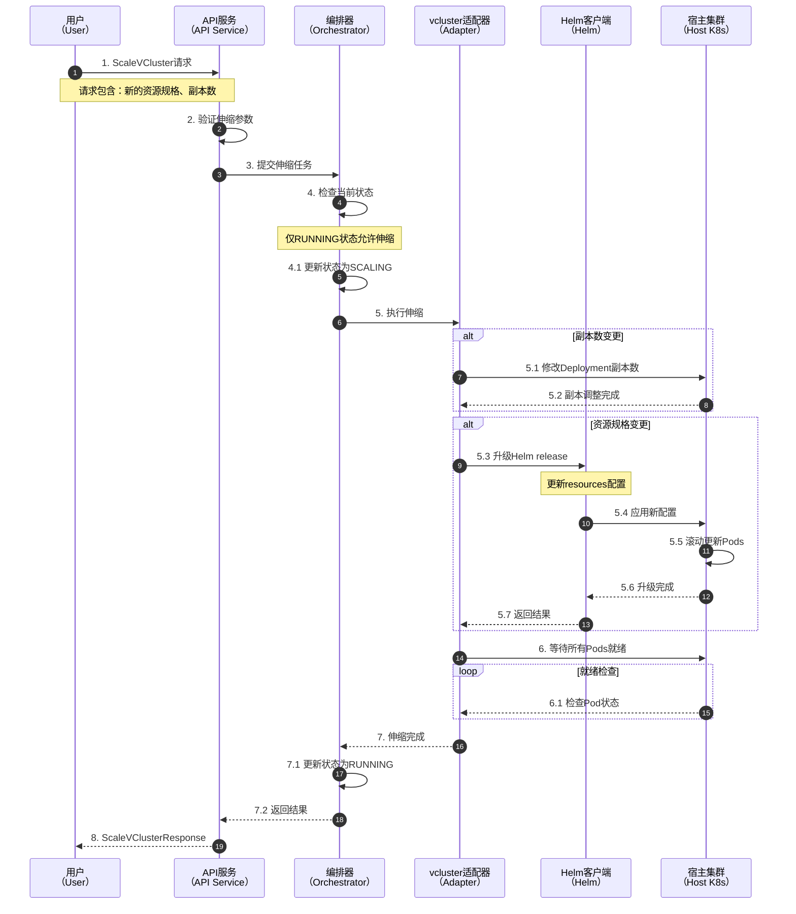
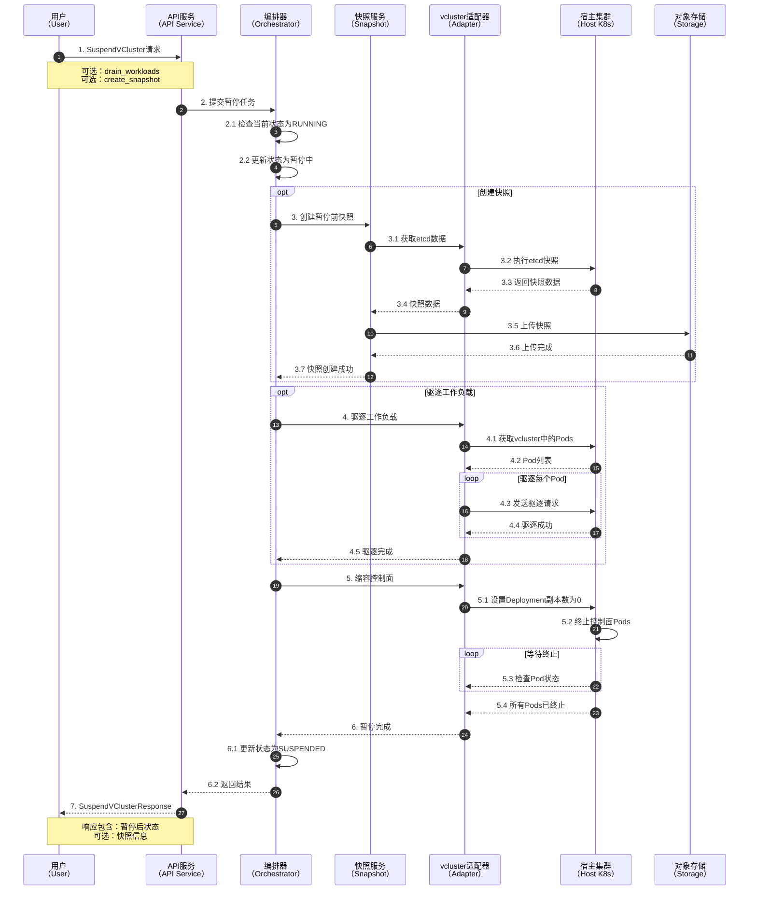
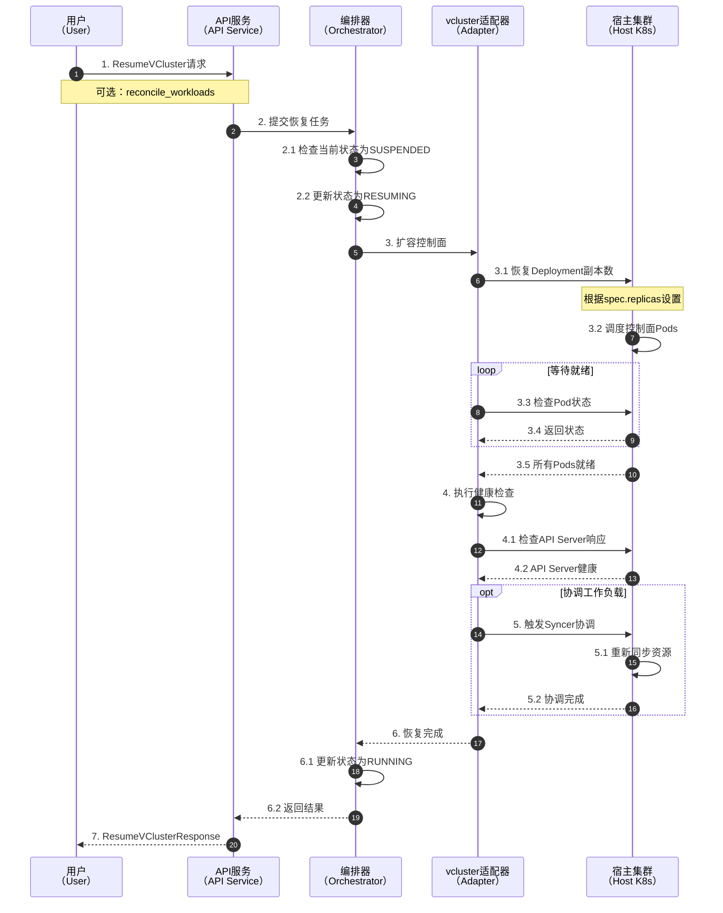
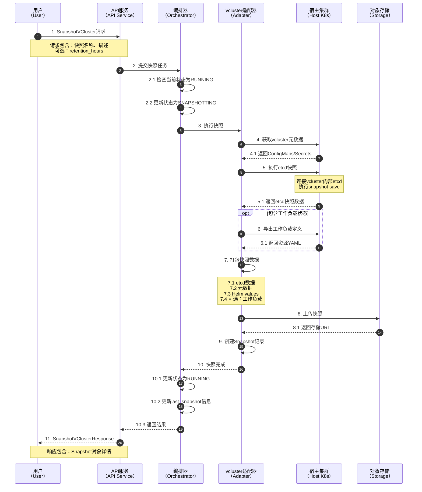
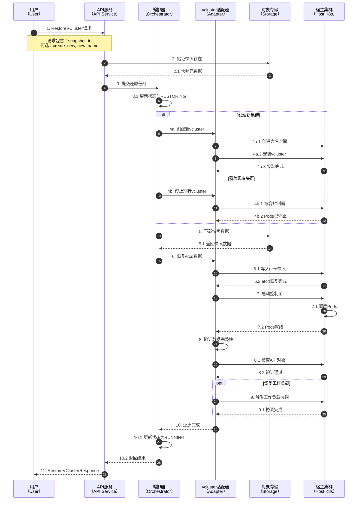
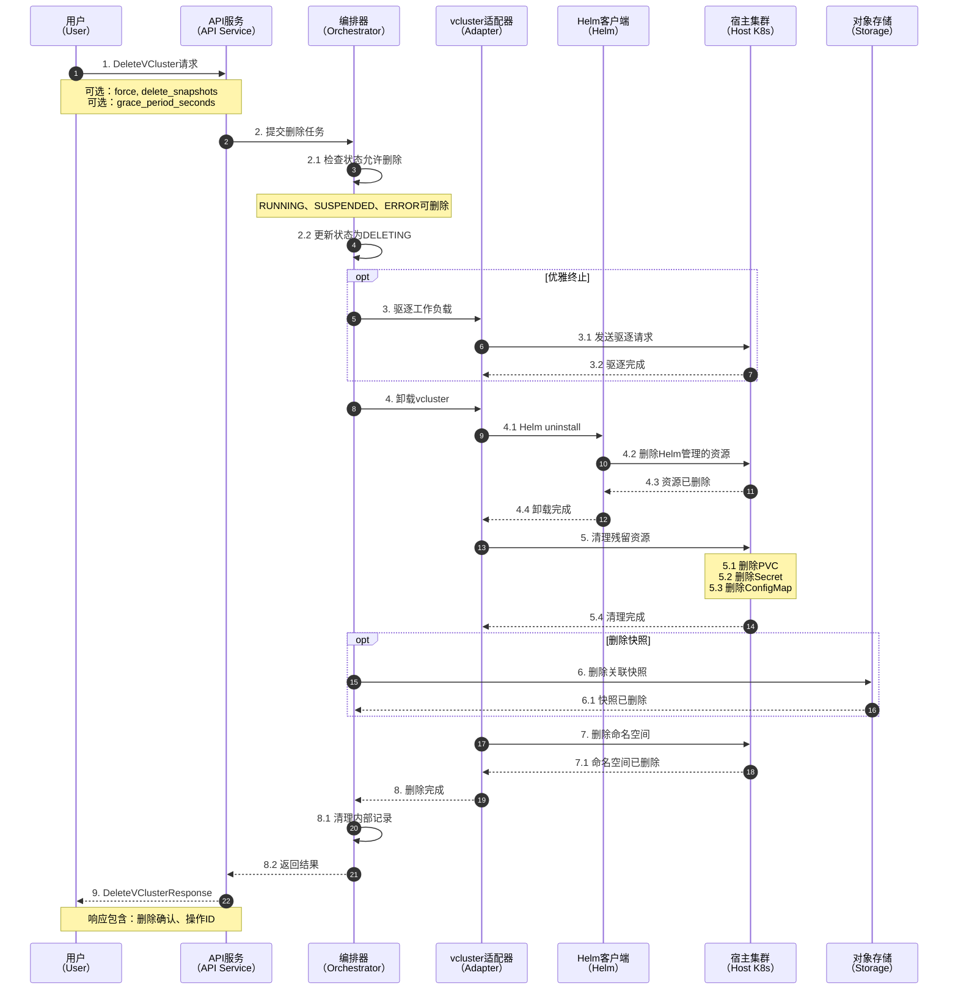
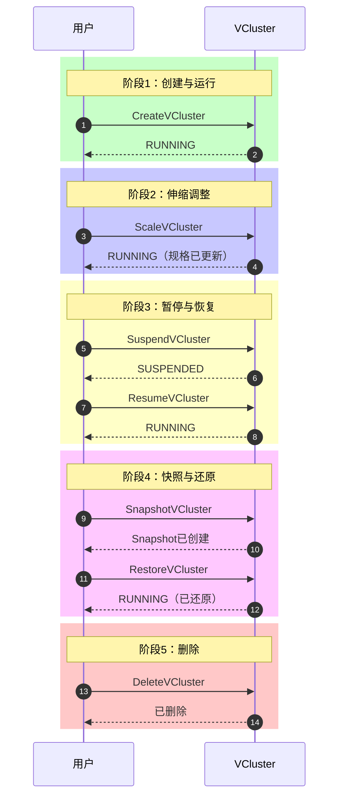

# VCluster生命周期序列图

本文档通过序列图详细展示VCluster从创建到删除的完整生命周期流程。

## 完整生命周期概览

```mermaid
graph LR
    %% 生命周期状态流转
    CREATE[创建<br/>Create] --> RUNNING[运行中<br/>Running]
    RUNNING --> SCALE[伸缩<br/>Scale]
    SCALE --> RUNNING
    RUNNING --> SUSPEND[暂停<br/>Suspend]
    SUSPEND --> SUSPENDED[已暂停<br/>Suspended]
    SUSPENDED --> RESUME[恢复<br/>Resume]
    RESUME --> RUNNING
    RUNNING --> SNAPSHOT[快照<br/>Snapshot]
    SNAPSHOT --> RUNNING
    RUNNING --> RESTORE[还原<br/>Restore]
    RESTORE --> RUNNING
    RUNNING --> DELETE[删除<br/>Delete]
    SUSPENDED --> DELETE
    DELETE --> DELETED[已删除<br/>Deleted]
````

## 创建流程（Create）

```mermaid
sequenceDiagram
    autonumber
    participant User as 用户<br/>（User）
    participant API as API服务<br/>（API Service）
    participant Validator as 校验器<br/>（Validator）
    participant Quota as 配额服务<br/>（Quota Service）
    participant Orch as 编排器<br/>（Orchestrator）
    participant Adapter as vcluster适配器<br/>（Adapter）
    participant Helm as Helm客户端<br/>（Helm）
    participant K8s as 宿主集群<br/>（Host K8s）

    User->>API: 1. CreateVCluster请求
    Note over User,API: 请求包含：名称、命名空间、规格配置

    API->>Validator: 2. 验证请求参数
    Validator->>Validator: 2.1 检查名称格式
    Validator->>Validator: 2.2 检查规格有效性
    Validator-->>API: 2.3 验证通过

    API->>Quota: 3. 检查资源配额
    Quota->>Quota: 3.1 计算所需资源
    Quota->>Quota: 3.2 比对可用配额
    Quota-->>API: 3.3 配额充足

    API->>Orch: 4. 提交创建任务
    Orch->>Orch: 4.1 生成唯一ID
    Orch->>Orch: 4.2 初始化状态为PENDING

    Orch->>Adapter: 5. 执行安装
    Adapter->>K8s: 5.1 创建目标命名空间
    K8s-->>Adapter: 5.2 命名空间就绪

    Adapter->>Helm: 6. 安装vcluster Chart
    Note over Helm: 6.1 渲染Helm模板<br/>6.2 准备资源清单
    
    Helm->>K8s: 7. 创建Kubernetes资源
    Note over K8s: 7.1 StatefulSet<br/>7.2 Service<br/>7.3 Secret<br/>7.4 RBAC资源
    K8s-->>Helm: 7.5 资源创建成功

    Helm-->>Adapter: 8. Helm安装完成
    Adapter->>Adapter: 8.1 更新状态为CREATING

    Adapter->>K8s: 9. 等待控制面就绪
    loop 健康检查
        K8s-->>Adapter: 9.1 检查Pod状态
    end
    K8s-->>Adapter: 9.2 所有Pods Running

    Adapter->>K8s: 10. 获取kubeconfig
    K8s-->>Adapter: 10.1 返回Secret内容

    Adapter->>Orch: 11. 安装完成
    Orch->>Orch: 11.1 更新状态为RUNNING
    Orch-->>API: 11.2 返回VCluster对象

    API-->>User: 12. CreateVClusterResponse
    Note over User,API: 响应包含：VCluster详情、kubeconfig
```

## 伸缩流程（Scale）



## 暂停流程（Suspend）



## 恢复流程（Resume）



## 快照流程（Snapshot）



## 还原流程（Restore）



## 删除流程（Delete）



## 完整生命周期时序



## 参考资料

1. [vcluster Lifecycle Management](https://www.vcluster.com/docs/using-vclusters/lifecycle) - vcluster生命周期管理
2. [Kubernetes Pod Lifecycle](https://kubernetes.io/docs/concepts/workloads/pods/pod-lifecycle/) - Kubernetes Pod生命周期
3. [Helm Release Lifecycle](https://helm.sh/docs/howto/charts_tips_and_tricks/) - Helm Release生命周期
4. [etcd Backup and Restore](https://etcd.io/docs/v3.5/op-guide/recovery/) - etcd备份恢复流程
