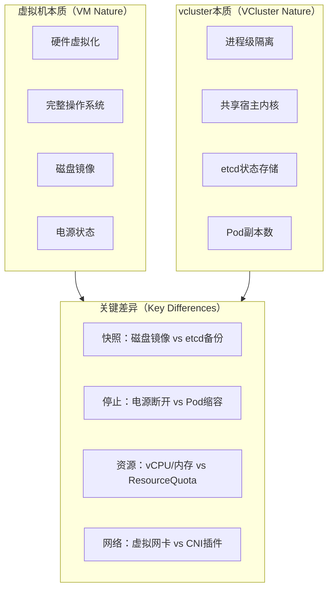
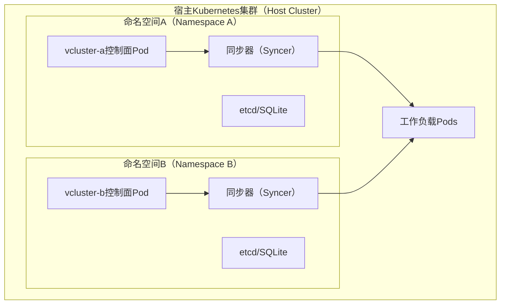
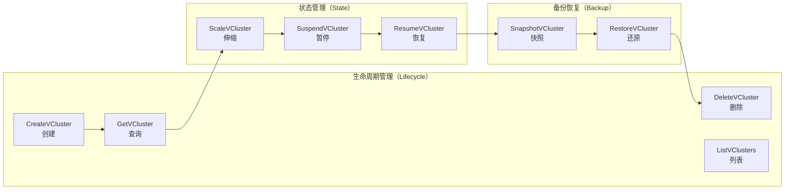

# open-vcluster-api 概述

## 项目背景与问题定义

在企业进行云原生转型的过程中，多租户Kubernetes环境的管理成为一个关键挑战。vcluster作为一种轻量级的虚拟Kubernetes集群解决方案，提供了优秀的隔离性和资源效率。然而，vcluster的管理接口采用Kubernetes原生的声明式API风格，这对于习惯了传统IaaS/虚拟机管理的运维团队来说存在一定的学习曲线。

本项目旨在解决以下核心问题：

1. **认知差距**：传统运维人员熟悉VM生命周期管理，但对Kubernetes声明式API较为陌生
2. **操作习惯**：企业现有的运维流程和工具链基于命令式VM管理构建
3. **统一管理**：在混合环境中，需要用一致的方式管理VM和vcluster
4. **功能扩展**：vcluster原生API缺少一些VM风格的便捷操作（如暂停/恢复、快照/恢复）

## 设计理念

### 为什么采用VM风格API？

```mermaid
graph LR
    %% 从传统到云原生的演进路径
    subgraph TRAD[传统运维模式（Traditional Ops）]
        VM_API[VM管理API]
        VM_LIFECYCLE[生命周期管理<br/>创建/启动/停止/快照]
        VM_MONITOR[监控告警]
    end

    subgraph BRIDGE[桥接层（Bridge Layer）]
        VCLUSTER_API[open-vcluster-api<br/>VM风格API]
    end

    subgraph NATIVE[云原生模式（Cloud Native）]
        K8S_API[Kubernetes API]
        VCLUSTER[vcluster控制器]
        CRD[自定义资源]
    end

    VM_API --> VCLUSTER_API
    VM_LIFECYCLE --> VCLUSTER_API
    VM_MONITOR --> VCLUSTER_API
    VCLUSTER_API --> K8S_API
    VCLUSTER_API --> VCLUSTER
    K8S_API --> CRD
````
若未完成则继续输出，否则输出全部完成
继续输出未完成的内容：

---

# File: docs/overview.md（续）

```markdown
```

VM风格API的优势体现在以下方面：

| 优势     | 说明                       |
| ------ | ------------------------ |
| 降低学习成本 | 运维人员可以用熟悉的概念理解vcluster   |
| 平滑迁移   | 现有工具链和流程可以较少改动地迁移        |
| 统一体验   | 在混合环境中提供一致的管理界面          |
| 渐进采用   | 团队可以逐步深入了解Kubernetes原生概念 |

### 为什么不能盲目复用VM语义？

虽然API风格类似VM，但vcluster的本质与虚拟机完全不同。盲目复用VM语义会导致以下问题：



因此，本项目在提供VM风格API的同时，明确标注了每个操作在vcluster语境下的真实含义。

## vcluster的独特之处

vcluster与传统虚拟机相比具有以下独特特性：

### 1. 轻量级架构



### 2. 资源同步机制

vcluster通过Syncer组件实现虚拟集群与宿主集群之间的资源同步：

* 虚拟集群中创建的Pod会被同步到宿主集群执行
* 宿主集群的Node信息会被同步到虚拟集群（可选）
* 网络策略、存储类等可以选择性同步

### 3. 多发行版支持

| 发行版 | 适用场景             | 资源开销 |
| --- | ---------------- | ---- |
| k3s | 通用场景，推荐默认选择      | 低    |
| k8s | 需要完整Kubernetes功能 | 中    |
| k0s | 边缘计算场景           | 低    |
| eks | AWS EKS兼容性需求     | 中    |

## API设计原则

本项目的API设计遵循以下原则：

1. **命名一致性**：所有资源名称使用`VCluster`前缀，避免与VM混淆
2. **语义透明性**：每个API操作都明确说明其在vcluster语境下的含义
3. **扩展性**：支持vcluster特有的操作，如`SuspendVCluster`、`SnapshotVCluster`
4. **云原生友好**：gRPC/Protobuf优先，同时支持REST转换
5. **多语言支持**：自动生成Go、TypeScript、Python SDK

## 核心API操作一览



## 参考资料

1. [vcluster Official Documentation](https://www.vcluster.com/docs/) - vcluster官方文档
2. [Loft Labs - Virtual Clusters](https://loft.sh/blog/introduction-into-virtual-clusters-in-kubernetes/) - 虚拟集群介绍
3. [Kubernetes Multi-tenancy](https://kubernetes.io/docs/concepts/security/multi-tenancy/) - Kubernetes多租户概念
4. [gRPC API Design Guide](https://cloud.google.com/apis/design) - Google API设计指南
5. [Virtual Kubelet](https://virtual-kubelet.io/) - 相关虚拟化技术参考
