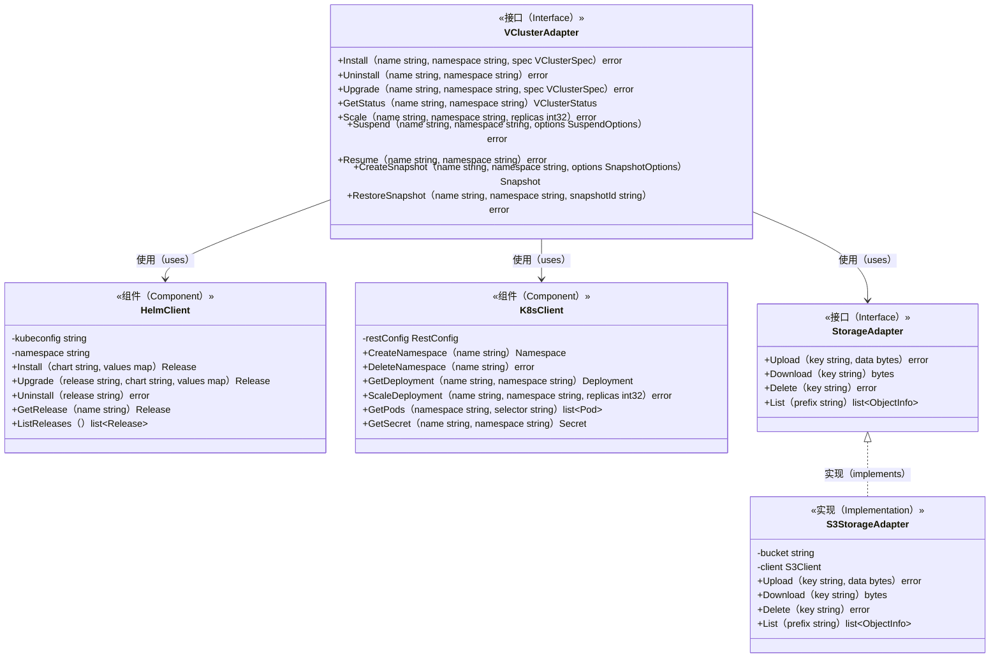

# VCluster类图

本文档展示open-vcluster-api的核心类型及其关系。

## 核心资源模型

以下类图展示了VCluster资源的完整数据模型，包括规格定义、状态表示和支撑类型。

```mermaid
classDiagram
    %% 核心资源类
    class VCluster {
        <<资源（Resource）>>
        +string id
        +string name
        +string namespace
        +VClusterSpec spec
        +VClusterStatus status
        +map~string,string~ labels
        +map~string,string~ annotations
        +Timestamp create_time
        +Timestamp update_time
        +Timestamp delete_time
        +string owner
        +string project
    }

    %% 规格定义
    class VClusterSpec {
        <<规格（Specification）>>
        +string kubernetes_version
        +ResourceRequirements resources
        +int32 replicas
        +NetworkConfig network
        +StorageConfig storage
        +bool enable_ha
        +string distro
        +string helm_values
        +SyncConfig sync
        +list~PluginConfig~ plugins
        +IngressConfig ingress
        +ServiceAccountConfig service_account
        +string isolation_mode
    }

    %% 状态表示
    class VClusterStatus {
        <<状态（Status）>>
        +Phase phase
        +string message
        +string reason
        +list~Condition~ conditions
        +string kubeconfig
        +string api_server_endpoint
        +ResourceUsage current_usage
        +int32 ready_replicas
        +int32 total_replicas
        +Timestamp ready_time
        +SnapshotInfo last_snapshot
        +HelmReleaseInfo helm_release
        +int64 observed_generation
    }

    %% 资源需求
    class ResourceRequirements {
        <<配置（Configuration）>>
        +string cpu_request
        +string cpu_limit
        +string memory_request
        +string memory_limit
        +string ephemeral_storage_request
        +string ephemeral_storage_limit
    }

    %% 资源使用
    class ResourceUsage {
        <<指标（Metrics）>>
        +string cpu_usage
        +string memory_usage
        +string storage_usage
        +int32 pod_count
        +int32 namespace_count
        +int32 service_count
    }

    %% 网络配置
    class NetworkConfig {
        <<配置（Configuration）>>
        +string pod_cidr
        +string service_cidr
        +bool enable_network_policies
        +string dns_service_ip
        +DNSConfig dns
    }

    %% 存储配置
    class StorageConfig {
        <<配置（Configuration）>>
        +string default_storage_class
        +bool enable_persistence
        +string persistence_size
        +string persistence_storage_class
    }

    %% 同步配置
    class SyncConfig {
        <<配置（Configuration）>>
        +bool sync_nodes
        +bool sync_persistent_volumes
        +bool sync_storage_classes
        +bool sync_ingresses
        +bool sync_priority_classes
        +bool sync_network_policies
        +list~string~ custom_resources
    }

    %% 入口配置
    class IngressConfig {
        <<配置（Configuration）>>
        +bool enabled
        +string ingress_class
        +string hostname
        +TLSConfig tls
        +map~string,string~ annotations
    }

    %% 条件
    class Condition {
        <<状态（Status）>>
        +string type
        +string status
        +string reason
        +string message
        +Timestamp last_transition_time
        +Timestamp last_probe_time
    }

    %% 快照信息
    class SnapshotInfo {
        <<信息（Info）>>
        +string id
        +string name
        +Timestamp create_time
        +int64 size_bytes
        +string status
    }

    %% 阶段枚举
    class Phase {
        <<枚举（Enumeration）>>
        PHASE_UNKNOWN
        PHASE_CREATING
        PHASE_RUNNING
        PHASE_SUSPENDED
        PHASE_SCALING
        PHASE_DELETING
        PHASE_ERROR
        PHASE_UPDATING
        PHASE_RESTORING
        PHASE_SNAPSHOTTING
        PHASE_RESUMING
        PHASE_PENDING
    }

    %% 快照资源
    class Snapshot {
        <<资源（Resource）>>
        +string id
        +string name
        +string vcluster_id
        +string vcluster_name
        +string namespace
        +SnapshotStatus status
        +int64 size_bytes
        +Timestamp create_time
        +Timestamp expire_time
        +map~string,string~ labels
        +string description
        +string storage_uri
    }

    %% 关系定义
    VCluster *-- VClusterSpec : 包含（contains）
    VCluster *-- VClusterStatus : 包含（contains）
    VCluster "1" --> "*" Snapshot : 拥有（owns）
    
    VClusterSpec *-- ResourceRequirements : 包含（contains）
    VClusterSpec *-- NetworkConfig : 包含（contains）
    VClusterSpec *-- StorageConfig : 包含（contains）
    VClusterSpec *-- SyncConfig : 包含（contains）
    VClusterSpec *-- IngressConfig : 包含（contains）
    
    VClusterStatus *-- Phase : 使用（uses）
    VClusterStatus *-- "*" Condition : 包含（contains）
    VClusterStatus *-- ResourceUsage : 包含（contains）
    VClusterStatus *-- SnapshotInfo : 包含（contains）
````

## 服务接口模型

以下类图展示了VClusterService的接口定义和请求/响应类型。

```mermaid
classDiagram
    %% 服务接口
    class VClusterService {
        <<接口（Interface）>>
        +CreateVCluster（CreateVClusterRequest）CreateVClusterResponse
        +GetVCluster（GetVClusterRequest）GetVClusterResponse
        +ListVClusters（ListVClustersRequest）ListVClustersResponse
        +UpdateVCluster（UpdateVClusterRequest）UpdateVClusterResponse
        +DeleteVCluster（DeleteVClusterRequest）DeleteVClusterResponse
        +ScaleVCluster（ScaleVClusterRequest）ScaleVClusterResponse
        +SuspendVCluster（SuspendVClusterRequest）SuspendVClusterResponse
        +ResumeVCluster（ResumeVClusterRequest）ResumeVClusterResponse
        +SnapshotVCluster（SnapshotVClusterRequest）SnapshotVClusterResponse
        +RestoreVCluster（RestoreVClusterRequest）RestoreVClusterResponse
        +GetVClusterKubeconfig（GetVClusterKubeconfigRequest）GetVClusterKubeconfigResponse
        +WatchVCluster（WatchVClusterRequest）stream~WatchVClusterResponse~
    }

    %% 创建请求
    class CreateVClusterRequest {
        <<请求（Request）>>
        +string name
        +string namespace
        +VClusterSpec spec
        +map~string,string~ labels
        +string request_id
        +bool wait_for_ready
        +int32 timeout_seconds
    }

    %% 创建响应
    class CreateVClusterResponse {
        <<响应（Response）>>
        +VCluster vcluster
        +string operation_id
    }

    %% 列表请求
    class ListVClustersRequest {
        <<请求（Request）>>
        +string namespace
        +int32 page_size
        +string page_token
        +string label_selector
        +list~Phase~ phases
        +string owner
        +string project
        +string order_by
    }

    %% 列表响应
    class ListVClustersResponse {
        <<响应（Response）>>
        +list~VCluster~ vclusters
        +string next_page_token
        +int32 total_count
    }

    %% 暂停请求
    class SuspendVClusterRequest {
        <<请求（Request）>>
        +string name
        +string namespace
        +bool drain_workloads
        +int32 drain_timeout_seconds
        +bool create_snapshot
        +string snapshot_name
    }

    %% 快照请求
    class SnapshotVClusterRequest {
        <<请求（Request）>>
        +string name
        +string namespace
        +string snapshot_name
        +string description
        +int32 retention_hours
        +map~string,string~ labels
        +bool include_workloads
    }

    %% 恢复请求
    class RestoreVClusterRequest {
        <<请求（Request）>>
        +string name
        +string namespace
        +string snapshot_id
        +bool create_new
        +string new_name
        +string new_namespace
        +bool restore_workloads
    }

    %% 关系
    VClusterService ..> CreateVClusterRequest : 接收（receives）
    VClusterService ..> CreateVClusterResponse : 返回（returns）
    VClusterService ..> ListVClustersRequest : 接收（receives）
    VClusterService ..> ListVClustersResponse : 返回（returns）
    VClusterService ..> SuspendVClusterRequest : 接收（receives）
    VClusterService ..> SnapshotVClusterRequest : 接收（receives）
    VClusterService ..> RestoreVClusterRequest : 接收（receives）
```

## 适配器层模型

以下类图展示了与底层系统交互的适配器组件。



## 参考资料

1. [Protocol Buffers Language Guide](https://protobuf.dev/programming-guides/proto3/) - Protobuf消息定义指南
2. [Kubernetes API Conventions](https://github.com/kubernetes/community/blob/master/contributors/devel/sig-architecture/api-conventions.md) - Kubernetes API约定
3. [Helm SDK](https://helm.sh/docs/topics/advanced/) - Helm SDK使用文档
4. [client-go](https://github.com/kubernetes/client-go) - Kubernetes Go客户端
